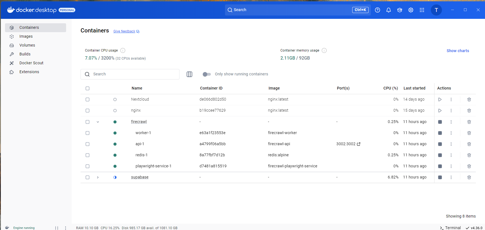

# Firecrawl Tests on a self-hosted Local Installation

## Introduction
This is a test of firecrawl using a local installation hosted in Docker
The offical documentation is available at the [Firecrawl Site](https://docs.firecrawl.dev/introduction). 
Here I wiill install a self-hosted version of firecrawl and test it out on my local machine

## Prerequisites
In order to run these tests we need to setup a local installation of Firecrawl.

1. Install [Docker Desktop](https://www.docker.com/products/docker-desktop/) if you do nit already have it installed
2. Fork firecrawl and clone the repository
3. Navigate to the root of the repository
4. Copy the .example.env file and rename it to .env. This will be used to configure the local installation
5. Update the .env file with your own Firecrawl API key.
6. Update the .env file set REDIS_URL to point to redis://localhost:6379
7. Update the .env file set REDIS_RATE_LIMIT_URL to point to redis://localhost:6379. Update the .env file set.
8. Update the .env file set USE_DB_AUTHENTICATION to false
9. Run the following command to build the docker image:

```bash
docker compose build
```
10. Run the following command to start the docker container:

```bash
docker compose up
```

You should now see Firecrawl running in your Docker Desktop



## Testing our new self-hosted Firecrawl installation. 
Now lets just do some simple test against our new Firecrawl installation.
As always we will stick in the compulsory cURL for the Mac and Linux users. 
And of course for any Windows users using Linux under WSL2.

```bash
curl -X POST http://localhost:3002/v1/crawl \
    -H 'Content-Type: application/json' \
    -H 'Authorization: Bearer <YOUR_FIRECRAWL_API_KEY>' \
    -d '{
      "url": "https://docs.firecrawl.dev",
      "limit": 2,
      "scrapeOptions": {
        "formats": ["markdown"]
      }
    }'
```

This should return a successful response similar to;

```json
{
  "success": true,
  "id": "8aa73c9b-3ff9-4442-a7d2-087c6090b204",
  "url": "https://localhost:3002/v1/crawl/8aa73c9b-3ff9-4442-a7d2-087c6090b204"
}
```

Here is the same test performed with Powershell on Windows

```powershell
irm http://localhost:3002/v1/crawl `
     -Method Post `
     -Headers @{ 
         'Authorization'='Bearer <YOUR_FIRECRAWL_API_KEY>'
         'Content-Type'='application/json'
     } `
     -Body (@{
         url = "https://docs.firecrawl.dev"
         limit = 100
         scrapeOptions = @{
             formats = @("markdown", "html")
         }
     } | ConvertTo-Json)
```

And the output

```powershell
success id                                   url
------- --                                   ---
   True 6404ceda-cd74-4c88-adb2-98c806d0b548 https://localhost:3002/v1/crawl/6404ceda-cd74-4c88-adb2-98c806d0b548
```

If you have got to this point you have a functioning Docker install of Firecrawl.
You can now try any of the examples in the firecrawl_x folders